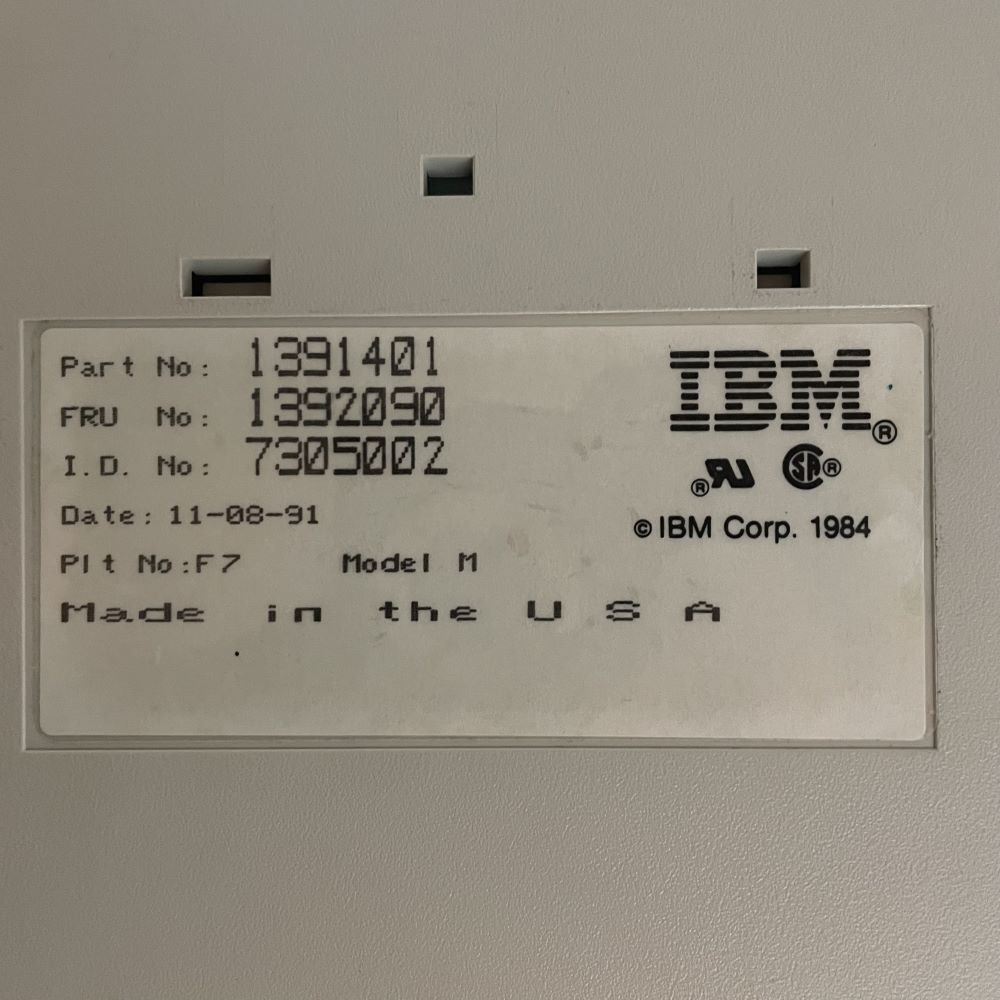

+++
image = "modelm.jpg"
date = "2023-03-16"
title = "The Model M"
type = "gallery"
+++

## Why I am Using a Keyboard That is Older Than Me

Such as Fortunado I have become a bit of a connoisseur. No, not for wine, but for the clicky clacky beep boops that come from keyboards. My current keyboard (my *daily driver*) is a custom-built 60% mechanical keyboard. I love my custom keyboard, very dearly, and it cost a bit more than I would like to admit. There is also something very novel about building something from the ground up and having it actually work when you plug it in. 

Recently, however, I have laid my grubby little fingers on my father’s IBM Model F keyboard. 
To my surprise, the clicks and clacks that came from this 1990 board were far more advanced than my luxury custom-built. It did not take long for the hyper fixation to kick in and I began endlessly scrolling through eBay to see what my options were when it came to the Porsche 911 of keyboards.

After a decent amount of research, I found that the [IBM Model M](https://youtu.be/D7wmMZmMinM) is the preferred driver of many connoisseurs. This is due to its unique [spring mechanisms](https://patentimages.storage.googleapis.com/36/4b/99/36af15e33d4aff/US3699296.pdf), its sheer 5lb heft, and its capability to work on a modern pc without the need for an expensive adapter. Additionally, it's a very nostalgic experience for those who aren't using a keyboard that’s older than they are. 

It didn’t take long for one to mysteriously appear at my door. The io experience on this beige behemoth is one for the books. I cannot recomend this vintage gem enough. 

