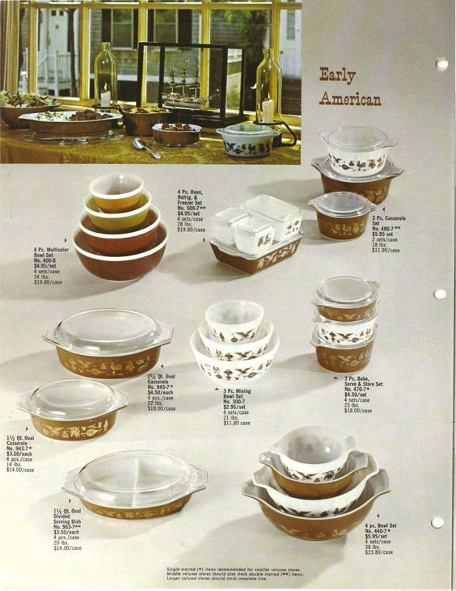
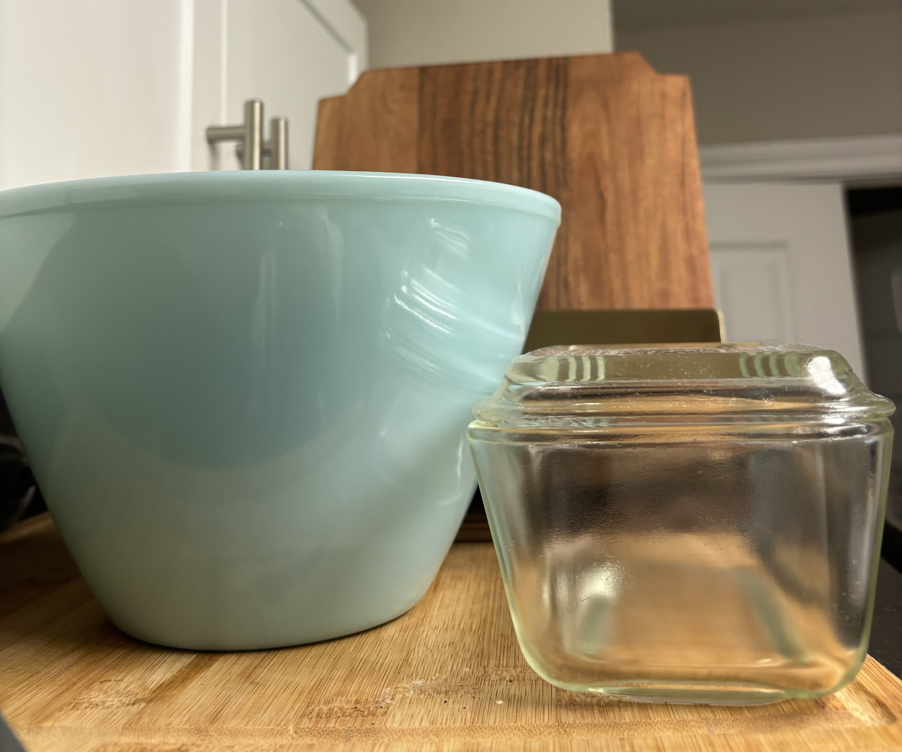

+++
title = "What My Kitchen Has Become"
date = "2024-04-04"
+++

The whys and hows of my antique kitchen.
<!--more-->

Home to me is my Mother's antique cake plates and yellowed Pampered Chef products. The opulent, swirly ends of our flatware that don’t quite match anything else. The decades-old ceramic casserole pan that gives us no-bake fudge and our favorite glorified chicken. The kitchen for me is the nucleus of the home. The center of holidays, first day of school breakfasts, totally chocolate dinners on bad days, and the list goes on.

Maybe I am just grasping at the straws in the nostalgic wind. But to me, recreating this warm feeling in my urban apartment was a necessary step to making it feel more like a home and less like a waypoint. Thus began the journey to replace all my glassware, flatware, utensils, and many other miscellaneous kitchen items with antique and vintage pieces. 

## A China Set is No Longer a Wedding Gift 

Standing in front of the dining set wall at Dillard's my mom told me that when I got married I got to pick any design I wanted and somebody else would buy the whole set for me. What a sweet deal I thought at no more than 7 years old. It's as if this tradition of gifting a dining set was like a seed packet to growing a home and eventually a family. Why wait for marriage, my 23-year-old self thinks? You still need something to eat on in the meantime, and I have chosen an amber cut-glass set that I found complete at an estate sale. 56 pieces for $60 is a pretty sweet deal too. 

## Forks and Knives

Before my current state of affairs, my kitchen was full of cheap crap from Target and things that remain from life with college roommates. The flatware was a dull gray with square ends that would bend if I said the word “dishwasher” in their direction. How lucky am I to have received a set of Dirilyte Regal flatware from my grandma. Sure it’s not as easy to clean and keep shining, but when I stir my coffee with a heavy gold tea spoon every morning I am reminded that this is indeed home.

## Speaking of Coffee 

Mugs and juice glasses and wine glasses and cocktail glasses. All staples in my cupboard, all sourced from antique malls and estate sales. My set of c.1950 milk-glass espresso cups and matching mugs are used every single morning. If the curse of The Beast’s castle came to my house and the mugs had a conversation I imagine they would be shocked at their sudden immortality when they thought their retirement had come and gone. 

I am so grateful to the antique dealer who let me buy a fraction of her hand-blown mid-century wine glasses. I went home with eight instead of sixteen at such a low cost I felt like I was stealing. The same gratitude to my Mother who gifted me the most stunning set of pink cocktail glasses that belong in Ina Garten’s Hampton home and certainly not mine. 

  

## Pyrex Pie Pans

My Mother’s apple pie is from her old church cookbook and it doesn’t include any real apples, but it does have two whole sticks of butter. And if it wasn’t made in a Pyrex pie plate then I’m not sure it would taste as good. Now if we see any vintage Pyrex for a decent price it's not uncommon we immediately purchase it with each other in mind. The pro is that my mixing bowls and bakeware look straight out of a 1967 issue of Better Homes and Gardens. The con is that only some of the pieces are oven and dishwasher-safe. 

## A Humble Warning 

PLEASE be mindful of lead and radiation in vintage and antique items! It is uncommon but there is a non-zero chance you pick up a green glass charger that would make a Geiger counter go beepbeepbeep. 

The Garlic Girl and a Gallery of Other Miscellaneous Items 

 
 
  

