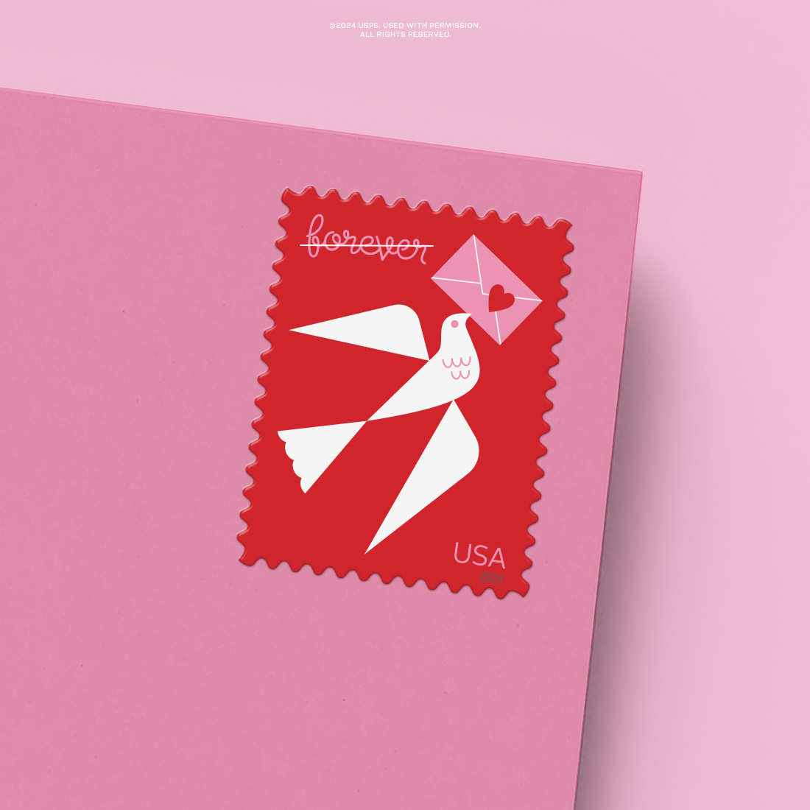

+++
title = "The 2024 Love Stamp"
date = "2024-01-06"
+++

My review and thoughts on this year's Love Stamp.

<!--more-->
Recently, I have dipped my toe into the ocean that is stamp collecting. This hobby is seemingly boundless and can be quite overwhelming at first glance, however, you can quickly conclude that the only rule is that there are no rules, which is why I have taken to judging the wares displayed on the USPS online store. 

The Love Stamp has been around since 1973 and the Postal Service releases a new iteration every year around January/ February to prepare for valentines and wedding invitations. All of these stamps feature some motif associated with love or Valentine's Day. 

The 2024 Love Stamp is lackluster, to say the least. The book of 20 stamps provides no variation in design. You simply get 20 of the same geometric white dove carrying a letter to an anonymous and presumably underwhelmed recipient. 

I will acknowledge at least the quaint nod to the now-defunct carrier pigeon and its role in postal history. However, as far as it goes for stamps marking historical significance this sets the bar low. Addtionally, if at all intended, the play on the word forever deserves at most a tip of the hat.

I cannot imagine the neutral-color-loving bride and her sad beige guests will be drawn to such a flagrant display of contrasting color. The girl who picked her bridesmaid’s dress to be the champaign-colored satin slip will find this red square to be intrusive on the back of her invitation that dawns the same champagne color as her sorority sisters.

The undergraduate who studies poetry and gender studies is more likely to put the snowglobe stamp on the poem he is sending his long-distance lover because it is what his roommate (his mom) had left over from the Christmas cards that lied about the family’s contentments. 

This stamp is to appease the under-appreciative grandmothers who still send valentines to their neighbors and children and grandchildren. I am not the generation modern stamp designs are targeting and yet it looks like it was created on Canva. 
